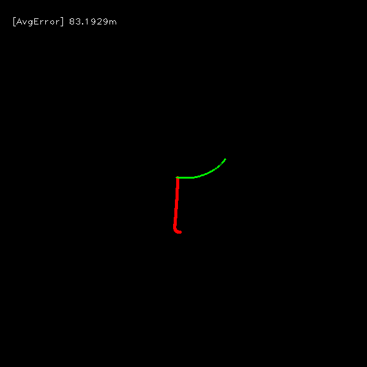

## Python-VO
A simple python implemented frame by frame visual odometry. This project is inspired and based on [superpoint-vo](https://github.com/syinari0123/SuperPoint-VO) and [monoVO-python](https://github.com/uoip/monoVO-python).

We tested handcraft features ORB and SIFT, deep learning based feature [SuperPoint](https://github.com/magicleap/SuperPointPretrainedNetwork), more feature detectors are also possible to be added to this project.
For feature matchers, we tested the KNN and FLANN mathers implemented in OpenCV, and the novel deep learning based mather [SuperGlue](https://github.com/magicleap/SuperGluePretrainedNetwork).

**Feature detectors**
- ORB (OpenCV implementation)
- SIFT (OpenCV implementation)
- [SuperPoint](https://github.com/magicleap/SuperPointPretrainedNetwork) 

**Feature matchers**
- KNN, FLANN (OpenCV implementation)
- [SuperGlue](https://github.com/magicleap/SuperGluePretrainedNetwork)

**SIFT Keypoints**


**SuperPoint Keypoints**


**SIFT+FLANN Matches**


**SuperPoint+FLANN Matches**


**SuperPoint+SuperGlue Matches**


## Install

- Get this repository
    ```bash
    git clone https://github.com/Shiaoming/Python-VO.git
    cd Python-VO
    ``` 
  
- Install python packages
    ```bash
    pip install -r requirements.txt
    ```

## Run
1. edit dataset path in `params/*.yaml`;
2. run `python main.py --config params/*.yaml` in terminal.
    
You can also adjust the ground-truth orientation for datasets that lack a heading (e.g. drone sequences) by adding either `gt_yaw_deg` or a full 3×3 matrix under the `dataset` section of the YAML.  The loader will post‑rotate every pose accordingly.

For example, rotate the drone GT by 90° yaw:
```yaml
# params/drone_rot90.yaml
dataset:
  name: DroneImageLoader
  root_path: test_imgs
  sequence: '01'
  start: 0
  gt_yaw_deg: 90          # new parameter
```

For example, to evaluate the SuperPoint with SuperGlue, run:

```bash
python main.py --config params/kitti_superpoint_supergluematch.yaml
```

## Evaluations
**Absolute and relative translation errors on KITTI sequence 00**


**Average relative translation errors on KITTI sequence 00**

| orb_brutematch |     sift_flannmatch | superpoint_flannmatch | superpoint_supergluematch |
| :------------: | :-------------------: | :-------------------: | :-----------------------: |
|     0.748m     |        0.085m         |        0.177m         |          0.103m           |

**Trajectory of ORB feature with brute matcher on KITTI sequence 00**


- red: ground truth
- green: estimated trajectory

**Trajectory of SIFT feature with FLANN matcher on KITTI sequence 00**


- red: ground truth
- green: estimated trajectory

**Trajectory of SuperPoint feature with FLANN matcher on KITTI sequence 00**


- red: ground truth
- green: estimated trajectory

**Trajectory of SuperPoint feature with SuperGlue matcher on KITTI sequence 00**


- red: ground truth
- green: estimated trajectory